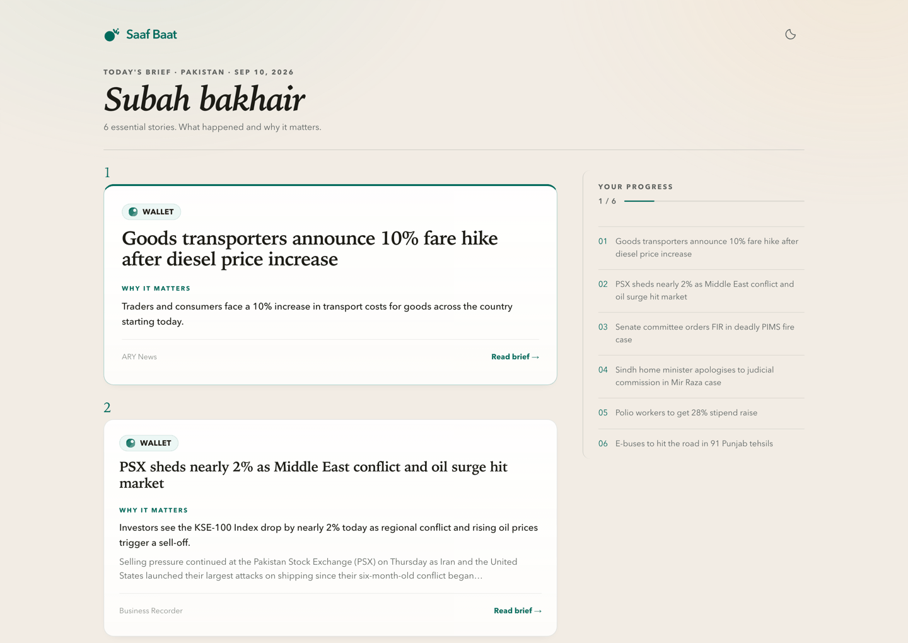
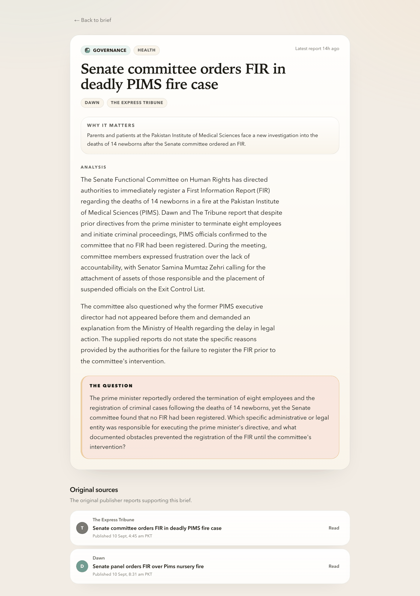

<p align="center">
  
</p>

<h1 align="center">Saaf Baat</h1>

<p align="center">
  <strong>A little clarity. Then get on with your day.</strong>
</p>

<p align="center">
  A calm morning brief for Pakistan — a handful of stories that matter, the context that makes them useful, and links to the reporting behind them.
</p>

<p align="center">
  
  
  
  
  
</p>

<p align="center">
  <video src="https://github.com/user-attachments/assets/04695013-06b1-4023-8ce5-41dd2c79da52" width="1200" controls muted playsinline></video>
</p>

<p align="center">
  <sub><a href="https://github.com/user-attachments/assets/04695013-06b1-4023-8ce5-41dd2c79da52">Watch the demo</a> if the player does not load.</sub>
</p>

<p align="center">
  <strong><a href="https://saaf-baat.vercel.app">Read today's brief</a></strong> ·
  <a href="#run-it-locally">Run it locally</a> ·
  <a href="#make-it-yours">Make it yours</a>
</p>

## Know enough to carry on

Open the brief and get straight to the day. Saaf Baat aims for **6–12 meaningful stories**, and fewer on a quiet day rather than filler to reach a number. No endless feed, no filters to configure before you can start reading, and a clear stopping point at the end.



## Understand why it matters

Prices, public services, decisions and developments worth your attention. Each card puts the impact up front. Open a story for a short explanation, the question the reporting leaves open, and the original publisher links.

<p align="center">
  
</p>

<sub>Real interface captures · Sample edition: 10 September 2026. Headlines are examples from that edition, not a claim of current news.</sub>

## Built for a quieter morning

- A finite brief with a real ending, not a feed that refills as you scroll.
- Original reporting from Pakistani publishers, with attribution on every story.
- Comfortable reading on a phone or a larger screen, in light or dark mode.
- Honest dates and visible failure states when a fresh edition is unavailable.

AI assists with grouping and writing. It can make mistakes; the original reporting remains the place to verify a claim. Saaf Baat is an early preview, and daily reliability checks are still in progress.

## Run it locally

You need **Python 3.11**, **Node.js 22**, and a **Gemini API key**. Local storage is SQLite, so no hosted account is required.

```bash
cp backend/.env.example backend/.env
cp frontend/.env.example frontend/.env.local
```

Set `GEMINI_API_KEY` in `backend/.env`, then prepare the first edition:

```bash
cd backend
python3.11 -m venv venv
source venv/bin/activate
pip install -r requirements.txt
python -m spacy download en_core_web_sm
python scripts/init_db.py
python run_pipeline.py --log-level INFO
uvicorn main:app --reload
```

In a second terminal:

```bash
cd frontend
npm ci
npm run dev
```

Open [localhost:3000](http://localhost:3000).

## Make it yours

The hosted setup uses **Vercel** for the website, **Render** for the read-only API, **Supabase** for storage, and **GitHub Actions** to prepare each morning's edition. Readers never trigger generation — the brief is written once a day and served from cache.

The repository includes the blueprint and workflow; provider accounts and secrets are still yours to add.

## Go deeper

- [Product decisions](AGENTS.md) — what this is, and what it deliberately is not
- [Working guide](CLAUDE.md) — architecture, thresholds, and why each one is what it is

<p align="center">
  
</p>

<p align="center">
  <strong>What happened. Why it matters. What to watch next.</strong>
</p>
