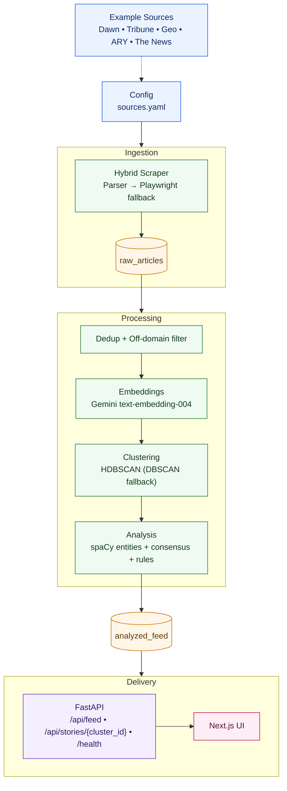

<p align="center">
  
</p>

<h1 align="center">Saaf Baat</h1>
<p align="center"><strong>The morning brief that tells you what is agreed, what is debated, and where to verify.</strong></p>

<p align="center">
  Multi-source Pakistan news, clustered into finite daily stories with transparent source attribution.
</p>

## Why Saaf Baat

Most news feeds optimize for endless scrolling. Saaf Baat optimizes for clarity.

You open once, skim a limited set of meaningful stories, see where reporting converges or diverges, and verify from original sources.

## What You Get

- A finite daily brief, not an infinite timeline.
- Story clustering across multiple publishers.
- Consensus signals (`confirmed_facts` vs `debated_claims`) based on cross-source overlap.
- Transparent source attribution on each card.
- Fast web UI and clean API contract.
- Pipeline health and stale-data detection for operations.

## Product Snapshot

- `frontend/`: Next.js 15 + React 19 App Router UI.
- `backend/`: FastAPI + scraping/NLP pipeline.
- Data flow: scrape -> dedupe -> embed -> cluster -> analyze -> serve.
- Current status: backend/frontend test suites and production builds are passing in the current branch.

## How It Works

### 1) Ingestion and Normalization

- Scrapes configured publishers from `backend/config/sources.yaml`.
- Filters off-domain links against configured source host.
- Inserts raw articles into Supabase, deduping by URL/content constraints.

### 2) Embeddings and Similarity

- Uses Gemini embedding model via `google-genai` in `backend/src/agents/embeddings.py`.
- Embeddings are normalized and stored for clustering and backfill safety.

### 3) Story Clustering

- Primary algorithm: HDBSCAN on embedding similarity.
- Fallback: DBSCAN when cluster quality thresholds are not met.
- Tuned by `min_cluster_size`, `min_clusters`, and `max_noise_ratio`.

### 4) Transparent Analysis (No LLM Summary Generation)

- Entity extraction with spaCy (`en_core_web_sm`).
- Consensus detector classifies entities as:
  - `confirmed_facts`: appear across enough sources.
  - `debated_claims`: partial/disputed overlap.
- Rule-based classifier (YAML rules in `backend/config/classification_rules.yaml`) assigns:
  - category
  - impact labels
  - confidence
- Snippets are deterministic from article text (not generative summaries).

### 5) API and UI Delivery

- `GET /api/feed` returns story cards.
- `GET /api/stories/{cluster_id}` returns full story detail + source links.
- `GET /health` returns DB connectivity + freshness/staleness signals.
- Frontend supports strict live mode (`NEXT_PUBLIC_STRICT_LIVE_DATA=1`) to block mock fallback in production.

## Architecture

Architecture starts from `backend/config/sources.yaml` where each source defines `base_url`, `feed_url`, and `sections`.



## Repository Layout

```text
backend/
  config/                   # sources + classification rules
  src/
    agents/                 # embeddings, clustering, analysis
    api/                    # FastAPI app + routes + DTOs
    db/                     # Supabase client + models
    pipeline/               # orchestration
    scrapers/               # source ingestion
  tests/                    # pytest suites
  run_pipeline.py           # scheduled pipeline entrypoint
  main.py                   # API app entrypoint

frontend/
  src/app/                  # Next.js routes
  src/components/           # UI components
  src/data/                 # API client + data adapters
  tests/                    # Jest + Testing Library
```

## Quick Start

### Prerequisites

- Python `3.11+` (recommended: `3.11.x`)
- Node.js `20+`
- npm `10+`

### Backend Setup

```bash
cd backend
python3.11 -m venv venv
source venv/bin/activate
pip install -r requirements.txt
uvicorn main:app --reload
```

Backend docs will be available at `http://127.0.0.1:8000/docs`.

### Frontend Setup

```bash
cd frontend
npm ci
npm run dev
```

Frontend runs at `http://localhost:3000` by default.

## Environment Variables

### Backend (`backend/.env`)

Required:

- `SUPABASE_URL`
- `SUPABASE_KEY`
- `GEMINI_API_KEY`

Operational:

- `ENVIRONMENT=production|development`
- `BACKEND_CORS_ALLOW_ORIGINS=https://app.example.com`
- `SAAF_PIPELINE_HEARTBEAT_FILE=backend/.pipeline_heartbeat.json`
- `SAAF_FEED_STALE_AFTER_HOURS=6`
- `SAAF_LOW_COST_MODE=1|0`
- `SAAF_MAX_ARTICLES_PER_SOURCE=20`
- `SAAF_EMBEDDING_BACKFILL_LIMIT=50`

### Frontend (`frontend/.env.local`)

- `NEXT_PUBLIC_API_URL=http://localhost:8000`
- `NEXT_PUBLIC_CITY_NAME=Islamabad`
- `NEXT_PUBLIC_DEFAULT_THEME=system`
- `NEXT_PUBLIC_STRICT_LIVE_DATA=1`

## Running the Pipeline

Daily/periodic run:

```bash
cd backend
source venv/bin/activate
python run_pipeline.py --disable-playwright --low-cost-mode
```

Useful flags:

- `--max-articles-per-source`
- `--embedding-backfill-limit`
- `--log-level INFO|DEBUG`

## API Contract

- `GET /health`
  - returns `status`, `database`, `latest_feed_created_at`, `last_successful_pipeline_run_at`, `pipeline_is_stale`.
- `GET /api/feed?limit=30&category=&impact_label=`
  - returns normalized story cards.
- `GET /api/stories/{cluster_id}`
  - returns story detail plus sorted source articles.

## Quality Gates

### Backend

```bash
cd backend
source venv/bin/activate
pytest
```

### Frontend

```bash
cd frontend
npm test -- --watch=false
npm run build
```

## Security and Secrets

- Never commit real API keys.
- Use `backend/.env.example` as template values only.
- If any key was ever exposed, rotate it before deployment.

## Documentation Kept in Repo

- `AGENTS.md`: active repository working conventions.
- `docs/final-ready-plan.md`: release checklist and completion tracking.

## License

License file can be added based on your preferred OSS license before public launch.
